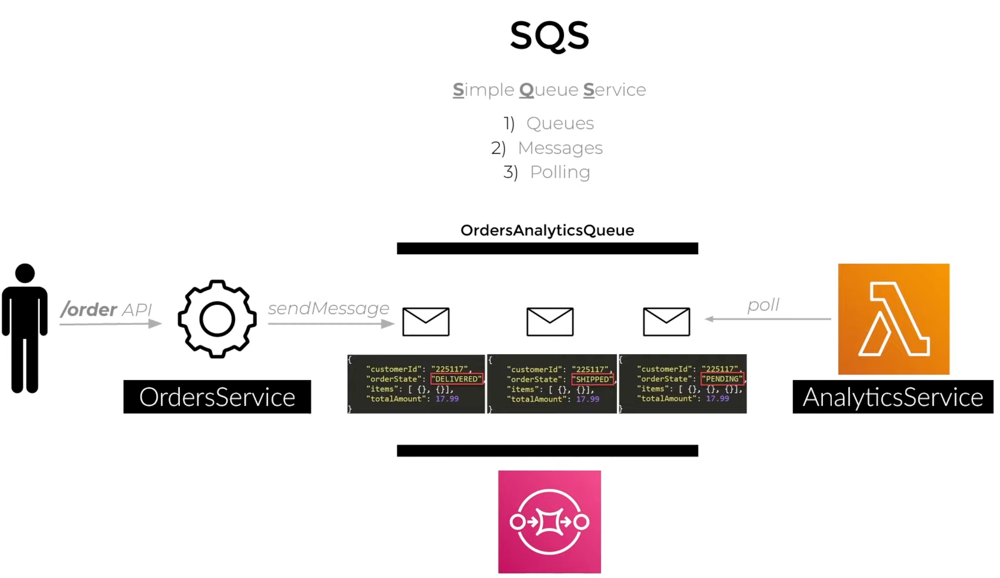
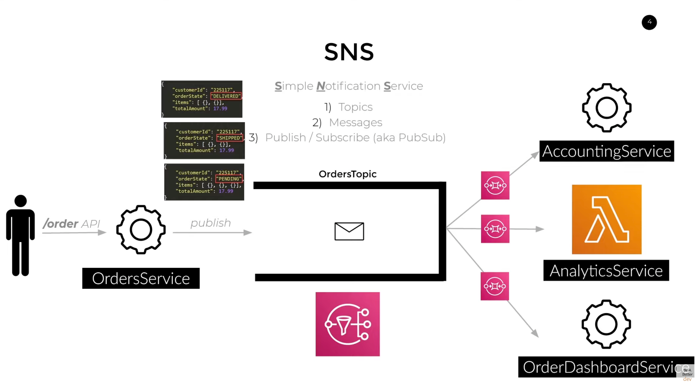
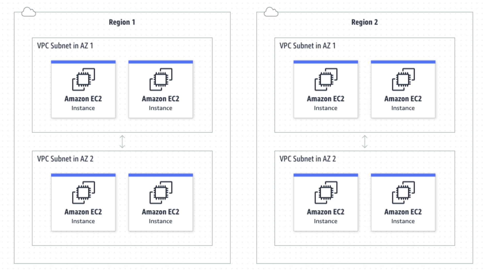

## RDS

It's the amazon service to use a relational database.

There are lots of databases available for usage: Postgres, aurora…

## SQS

**S**imple **Q**ueue **S**ervice is used to implement a queue to deliver messages.

You put a message in the queue, which is available for some service polling (get) it.

Note that the message is removed from the queue as some service polls the message. Thus you cannot "get" this message in multiple services. Note that the queue does not keep the arrival order of the messages, though you can specify that you want to keep this order on the queue creation.

## SNS

**S**imple **N**otification **S**ervice is a service from Amazon used to decouple your system using notifications.

The SNS is like an implementation of a PubSub. You put a message into the SNS Topic, and the SNS will notify all the systems listening to this topic.

The SNS retries to deliver the message whenever it fails to be delivered (this is configured, and by default, to this date, it's three). When the number of retries is exhausted, the SNS either discard the message or sends it to a dead-letter queue (DLQ)

## VPC

Logical isolated network.



### NAT Gateway

It allows a **VPC** network to connect to external devices. NAT could be either:
- **Public**: to allow the VPC to access the public internet.

Public NAT does not allow unsolicited inbound requests.

- **Private**: to allow the VPC to access other VPCs.

---

**\***: I got it from the internet, and I don't remember the source. Sorry for that. Just give a hint if it's yours, and I'll update the refs.
