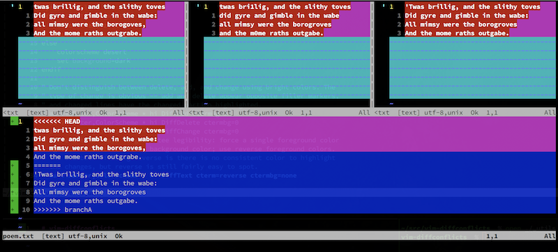

I don't like 3-ways merge. For a long time, I've been using this [plugin](https://github.com/whiteinge/diffconflicts) to solve my merge conflicts in a 2-way way.



In a Reddit [comment](https://www.reddit.com/r/neovim/comments/ug96n9/comment/i72djxv/) today, someone posted that GIT has built-in support to 2-ways in (n)vim since 2021 🤯.

To activate it, first check if your GIT version has support for it:

```bash
# (n)vimdiff1 is what you are looking for
git mergetool --tool-help
```

After checking the support, enable it with:

```bash
git mergetool --tool=nvimdiff1
```
